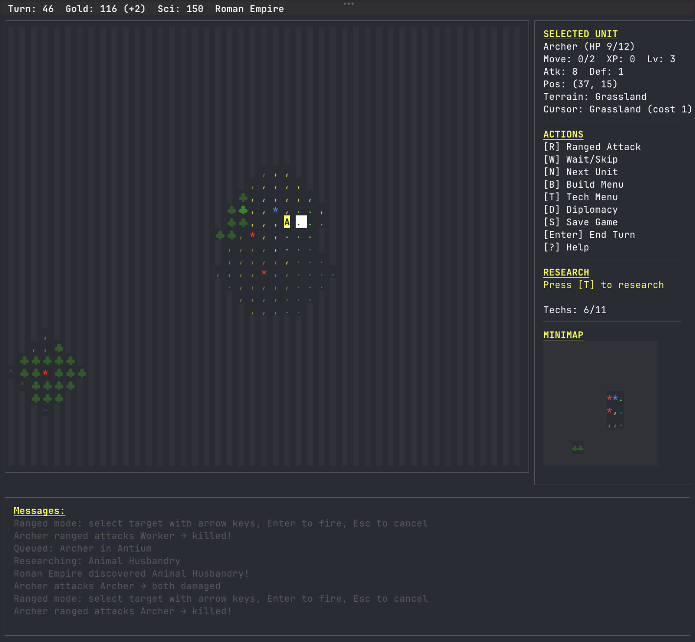

# civ-tui

**A full-featured Civilization-style 4X strategy game that runs entirely in your terminal.**

Build cities, research technologies, command armies, negotiate diplomacy -- all from the comfort of your command line. No GUI, no browser, no game engine. Just you, your terminal, and the quest for world domination.



---

## Features

**Complete 4X Gameplay Loop** -- Explore, Expand, Exploit, Exterminate in ~4,700 lines of Go.

- **Procedural Maps** -- Fractal noise terrain generation with continent-style layouts. 9 terrain types, 3 map sizes, fog of war, coordinate grid labels
- **8 Unit Types** -- Settlers, Scouts, Warriors, Archers, Spearmen, Swordsmen, Horsemen, Workers -- each with unique stats
- **City Building** -- Found cities, manage population growth, construct buildings, queue production
- **11-Tech Tree** -- Research technologies to unlock advanced units, buildings, and improvements
- **Combat System** -- Melee & ranged combat, terrain defense bonuses, experience & leveling, combat logs with civ names and coordinates
- **Pathfinding & Goto** -- Set movement destinations with Dijkstra pathfinding; units auto-advance each turn. Reachable tiles highlighted via BFS flood-fill
- **Diplomacy** -- Declare war, negotiate peace. Multiple AI civilizations with strategic decision-making
- **5 Civilizations** -- Rome, Mongolia, Egypt, China, Greece -- each with historical city names
- **Workers & Improvements** -- Build farms, mines, roads, and lumber mills to boost your economy
- **Bilingual (EN/ZH)** -- Full English and Simplified Chinese support with automatic system language detection
- **Save/Load** -- Full game state persistence via JSON. Pick up where you left off
- **Multiple Victory Conditions** -- Domination, Science, or survive to turn 200

## Quick Start

### Install via Go

```bash
go install github.com/RockChinQ/civ-tui@latest
civ-tui
```

### Build from Source

```bash
git clone https://github.com/RockChinQ/civ-tui.git
cd civ-tui
make run
```

### Download Prebuilt Binaries

Prebuilt binaries for Linux, macOS, and Windows are available on the [Releases](https://github.com/RockChinQ/civ-tui/releases) page.

**Requirements:** Go 1.24+ (for building from source), a terminal with 256-color support.

## Controls

| Key | Action |
|-----|--------|
| `Arrow keys` / `hjkl` | Move cursor / selected unit |
| `Enter` | End turn |
| `F` | Found city (Settler) |
| `B` | Open build menu (on your city) |
| `T` | Tech research menu |
| `D` | Diplomacy menu |
| `R` | Ranged attack mode (Archer) |
| `I` | Build improvement (Worker) |
| `V` | View city details (own city) / inspect tile |
| `G` | Set movement destination (Goto mode) |
| `X` | Cancel unit's movement destination |
| `W` | Wait / skip unit turn |
| `N` | Cycle to next unit or city needing attention |
| `S` | Save game |
| `Esc` | Deselect / close menu / cancel mode |
| `?` | Help screen |
| `Q` | Quit |

Vim users rejoice -- `hjkl` navigation works everywhere.

## Game Settings

Configure from the **New Game** screen before starting:

| Setting | Options |
|---------|---------|
| Map Size | Small (40x25), Medium (60x35), Large (80x48) |
| AI Opponents | 1 - 4 |
| Difficulty | Easy, Normal, Hard |

Language can be changed in the **Settings** menu (English / 简体中文). The game auto-detects your system language on first launch and saves the preference to `~/.civ-tui/config.json`.

## Architecture

```
civ-tui/                 (~4,700 lines of Go)
├── main.go              # Entry point
├── i18n/                # Internationalization (EN / ZH)
├── game/                # Game logic (zero TUI dependencies)
│   ├── model/           #   Domain models (unit, city, civ, tech, tile)
│   └── worldmap/        #   Procedural map generation
└── tui/                 # Terminal UI (Bubble Tea)
```

Game logic is fully decoupled from the TUI layer -- the `game/` package has zero UI imports, making it independently testable.

## Tech Stack

- **[Go](https://go.dev/)** -- Simple, fast, compiles to a single binary
- **[Bubble Tea](https://github.com/charmbracelet/bubbletea)** -- Elm Architecture for terminal apps
- **[Lipgloss](https://github.com/charmbracelet/lipgloss)** -- Terminal styling and layout
- **Custom fractal noise** -- No external dependencies for map generation

## Development

```bash
make build    # Compile
make run      # Build and run
make test     # Run tests
make lint     # Run go vet
make clean    # Clean build artifacts
```

## Roadmap

All 7 core development phases are complete. Future directions include:

- Strategic & luxury resources
- Naval units
- Rivers & advanced terrain
- Culture, religion, and policy systems
- World wonders
- Trade routes
- Mouse support
- Battle animations
- More unit types and civilizations

## License

[GPL-3.0](LICENSE)
